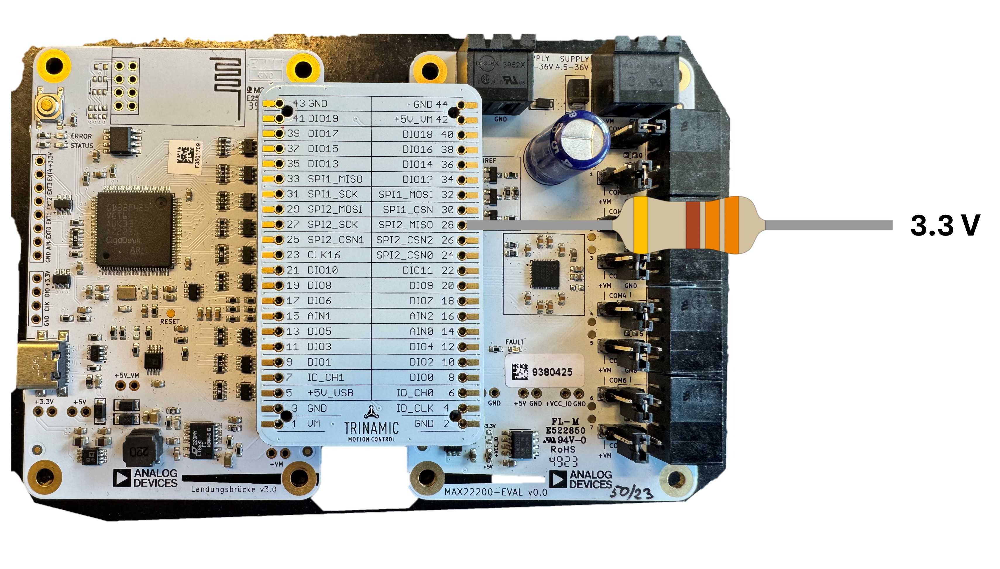

# MAX22200

## How to use

To access the MAX22200's registers, the TMC-API offers two functions: **max22200_readRegister** and **max22200_writeRegister**.
Each of these functions takes in an **icID**, which is used to identify the IC when multiple ICs are connected. This identifier is passed down to the callback functions (see How to Integrate).

## How to integrate: overview

1. Include all the files of the TMC-API/ic/max22200/MAX22200 folder into the custom project.
2. Include the MAX22200.h file in the custom source code.
3. Implement the necessary callback functions (see below).

## Accessing the MAX22200 via SPI
One important thing to make sure is that the MISO pin of SPI is connected externally to the 3.3V via a 330 ohms resistor as show in the picture below.

The following diagram depicts how to access the MAX22200 via SPI using the TMC-API.

The description of the functions, in the above flowchart, are as follows:
- The functions max22200_readRegister and max22200_writeRegister are used to read and write the registers respectively. These functions check the current active bus and call the bus-specific function i.e readRegisterSPI or writeRegisterSPI.
- These bus specific functions construct the datagram and further call the bus specific callback 'max22200_readWriteSPI'.
- This callback function further calls the hardware specific read/write function for SPI and needs to be implemented externally.

### How to integrate: Callback functions
Implement the following callback functions to access the chip via SPI:
1. **max22200_readWriteSPI()**, which is a HAL wrapper function that provides the necessary hardware access. This function should also set the CMD pin to high for writing a register and set it low for reading a register. Please refer to the datasheet of the IC for further details.

## Further info
### Dependency graph for the ICs with new register R/W mechanism
This graph illustrates the relationships between files within the TMC-API library, highlighting dependencies and identifying the files that are essential for integrating the library into custom projects.

### Example usage: TMC-Evalsystem
**For a reference usage of the TMC-API**, visit the [TMC-Evalsystem](https://github.com/analogdevicesinc/TMC-EvalSystem)

## Migration status
The MAX22200 has been reworked to the access system described above. For more infos on the status of this and other ICs, check out the [migration page](https://github.com/analogdevicesinc/TMC-API/issues/53).