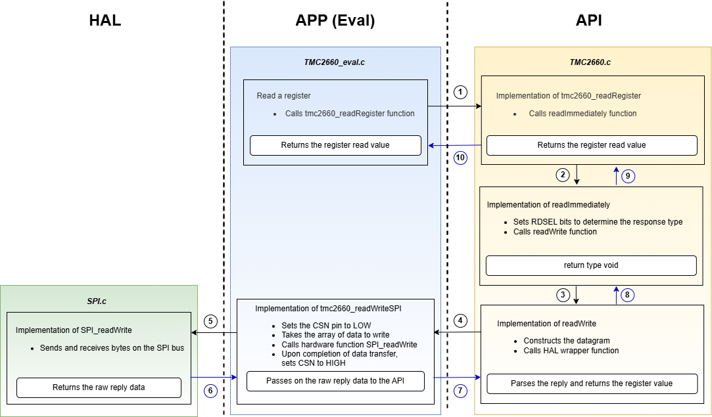
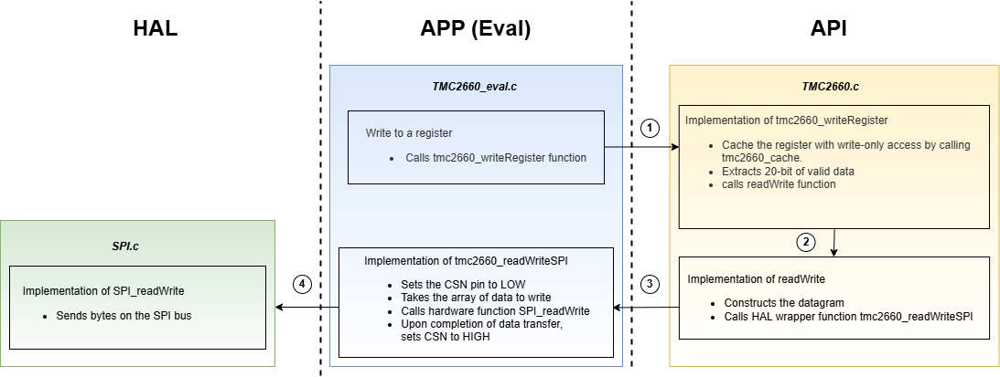

# TMC2660

## How to use

To access the TMC2660's registers, the TMC-API offers two functions: **tmc2660_readRegister** and **tmc2660_writeRegister**.
Each of these functions takes in an **icID**, which is used to identify the IC when multiple ICs are connected. This identifier is passed down to the callback functions (see How to Integrate).

## How to integrate: overview

1. Include all the files of the TMC-API/ic/tmc/TMC2660 folder into the custom project.
2. Include the TMC2660.h file in the custom source code.
3. Implement the necessary callback functions (see below).

## Accessing the TMC2660 via SPI
The following diagram depicts how to access the TMC2660 via SPI using the TMC-API.

### Reading a register

The description of the functions, in the above flowchart, are as follows:
- The functions tmc2660_readRegister and tmc2660_writeRegister are used to read and write the registers respectively. 
- tmc2660_writeRegister function calls the readWrite function which constructs the datagram and further calls the bus specific callback 'tmcXXXX_readWriteSPI'.
- This callback function further calls the hardware specific read/write function for SPI and needs to be implemented externally.
- tmc2660_readRegister function calls readImmediately function if it has to read one of the three responses.
- readImmediately funciton sets the RDSEl bits in DRVCONF register and further calls the readwrite function to receive the response.

### Writing a register

Similarly, a register is written as depicted in the flowchart above.

### How to integrate: Callback functions
In software we use a **continuousModeEnable** variable to distinguish between a normal mode and a continuous mode. In continuous mode we periodically read all the registers to keep them updated incase of brownout. For that, the callback function **tmc2660_getcontinuousModeEnable()** needs to be implemented.
Additionally, implement the following callback functions to access the chip via SPI:
**tmc2660_readWriteSPI()**, which is a HAL wrapper function that provides the necessary hardware access. This function should also set the chip select pin CSN to low before starting the data transfer and set to high upon completion. Please refer to the datasheet of the IC for further details.

### Option to use the cache logic for Write-Only registers
The chip features write-only registers that are unable to be read, necessitating the creation of a shadow copy to cache their contents. This copy is automatically updated whenever data is written to these registers. This cache logic could be enabled by setting the macro **TMC2660_CACHE** to **'1'** or disabled by setting to **'0'** respectively. If this feature is enabled then there comes another option to use **tmc2660_cache** function, which is already implemeted in the API, by defining **TMC2660_ENABLE_TMC_CACHE** macro to **'1** or one can implement their own function. The function **tmc2660_cache** works for both reading from and writing to the shadow array. It first checks whether the register has write-only access and data needs to be read from the hadow copy. On the basis of that, it returns **true** or **false**. The shadowRegisters on the premade cache implementation need to be one per chip. **TMC2660_IC_CACHE_COUNT** is set to '1' by default and is user-overwritable. If multiple chips are being used in the same project, increment its value to the number of chips connected.

## Further info
### Dependency graph for the ICs with new register R/W mechanism
This graph illustrates the relationships between files within the TMC-API library, highlighting dependencies and identifying the files that are essential for integrating the library into the custom projects.

### Example usage: TMC-Evalsystem
**For a reference usage of the TMC-API**, visit the [TMC-Evalsystem](https://github.com/analogdevicesinc/TMC-EvalSystem)

## Migration status
The TMC2660 has been reworked to the access system described above. For more infos on the status of this and other ICs, check out the [migration page](https://github.com/analogdevicesinc/TMC-API/issues/53).

