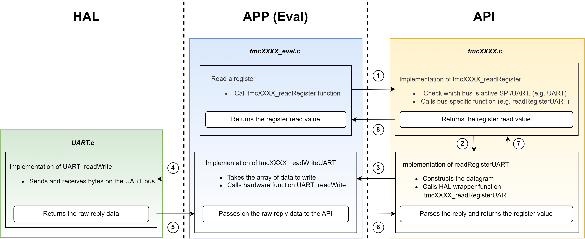

# TMC5271

## Accessing the TMC5271
The following diagram depicts how to access the TMC5271 using the TMC-API.

The description of the functions that the user needs are as follows:
- The functions tmc5271_readRegister and tmc5271_writeRegister are used to read and write the registers respectively. These functions check the current active bus and calls the bus-specific function e.g readRegisterUART, etc.
- The bus specific function constructs the datagram and further calls the bus specific callback.
- The user needs to externally implement this callback or HAL wrapper function that should further call the hardware specific read/write function for that particular bus type.

### How to use

To access the TMC5271's registers, the TMC-API offers two functions: **tmc5271_readRegister** and **tmc5271_writeRegister**.
Each of these functions takes in an **icID**, which is used to identify the IC should you have multiple ICs connected. This identifier simply gets passed down to the callback functions (see How to Integrate).

### How to integrate: overview

- Add all the files of the TMC-API/ic/tmc/TMC5271 folder into your project.
- Include the TMC5271.h file in your source code.
- Implement the necessary callback functions (see below).
- (optional): Take a look at the Examples subfolder for ready-made examples of the TMC-API usage.

#### How to integrate: Callback functions
To communicate with a TMC5271 , the TMC-API needs to know which bus (UART, SPI) it shall use. For that you must implement the **tmc5271_getBusType()** callback function.
If you want to access the chip using UART, also implement these callback functions:
- **tmc5271_readWriteUART()**, which is a HAL wrapper function that provides the necessary hardware access.
- **tmc5271_getNodeAddress()**, that returns the node/slave address. Node address could be set in NODECONF (0x3) register and the address could be incremented as defined by AD0, AD1 and AD2. (Node address + ADx) must be less than 255. For further details please consult the datasheet of TMC5271.

If you want to access the chip using SPI, also implement this callback function:
- **tmc5271_readWriteSPI()**, which is a HAL wrapper function that provides the necessary hardware access.

#### Sharing the CRC table with other TMC-API chips
The TMC5271 UART protocol uses an 8 bit CRC. For calculating this, a table-based algorithm is used. This table (tmcCRCTable_Poly7Reflected[256]) is 256 bytes big and identical across multiple different Trinamic chips (i.e. TMC2209).
If your project uses multiple Trinamic chips you can avoid having redundant copies of this table, saving memory size. You can also replace by your own CRC Table.

## Further info
### Dependency graph for the ICs with new register R/W mechanism
This graph illustrates the relationships between files within our library, highlighting dependencies and enabling users to easily identify which files are essential for integrating our library into their custom projects. This serves as a helpful tool for users seeking to effectively utilize our library in their projects.

### Example usage: TMC-Evalsystem
**For a reference usage of the TMC-API**, visit the [TMC-Evalsystem](https://github.com/analogdevicesinc/TMC-EvalSystem)

## Migration status
The TMC5271 has been reworked to the access system described above. For more infos on the status of this and other ICs, check out the [migration page](https://github.com/analogdevicesinc/TMC-API/issues/53).

