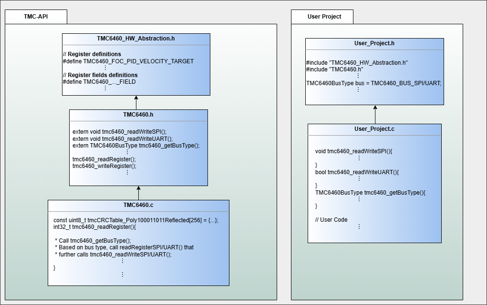

# TMC6460

## How to use

To access the TMC6460's registers, the TMC-API offers two functions: **tmc6460_readRegister** and **tmc6460_writeRegister**.

For easier control over individual bitfields within registers, the following functions are also offered: **tmc6460_extractField**, **tmc6460_readField**, **tmc6460_updateField**, **tmc6460_writeField**, and **tmc6460_fieldInRange**.

Each function that interacts with a TMC6460 IC takes in an **icID**, which is used to identify the IC when multiple ICs are connected. This identifier is passed down to the callback functions (see "How to Integrate" below).

## How to integrate: Overview

The TMC-API is designed to be added to your application project by simply adding the relevant IC folder (TMC-API/ic/tmc/TMC6460) to your project, adding .c file(s) to your compilation, and including any needed .h file(s).
No editing of the TMC-API files is required - with the one potential exception being the feature flags - see "How to integrate - Feature Flags" below.

1. Include all the files of the TMC-API/ic/tmc/TMC6460 folder into your project.
2. (optional): Activate optional TMC-API features either by editing the relevant #define lines in TMC6460.h, or by setting these defines in your build system (See "How to Integrate - Feature Flags" below)
3. Include the TMC6460.h file in your C/C++ code.
4. Implement the necessary callback functions (see below).

### How to integrate - Feature Flags
The TMC-API implementation for the TMC6460 has a few feature flags to enable additional functionality.
Using these features requires additional integration steps from the application.

Feature flags are controlled by a C/C++ define set to either 1 or 0. By default, these features disabled (set to 0).
To activate them, either edit the corresponding lines at the top of the TMC6460.h file, or set these defines in your build system (recommended).

Available feature flags:
- TMC_API_TMC6460_RTMI_SUPPORT: If enabled, the UART RTMI feature can be used. Requires additional callback implementations (**tmc6460_RTMIDataCallback**, **tmc6460_isRTMIEnabled**, and **tmc6460_availableBytes**).
- TMC_API_TMC6460_CRC_SUPPORT: If enabled, the UART CRC feature can be used. Requires additional callback implementations (**tmc6460_isNormalCRCEnabled** and **tmc6460_isRTMICRCEnabled**)

### How to integrate: Callback functions
The TMC-API uses various callback functions to achieve its functionality. These callback functions must be implemented in your application code. Each function has a detailed description of what it must do inside the TMC6460.h file.

Always required callback functions:
- **tmc6460_readWriteSPI**: Called by TMC-API to access SPI hardware
- **tmc6460_readWriteUART**: Called by TMC-API to access UART hardware
- **tmc6460_getBusType**: Called by TMC-API to determine whether to use SPI or UART

Callback functions for RTMI feature (TMC_API_TMC6460_RTMI_SUPPORT feature flag):
- **tmc6460_RTMIDataCallback**: Called by TMC-API to pass received RTMI data to the application
- **tmc6460_isRTMIEnabled**: Called by TMC-API to determine whether RTMI is active
- **tmc6460_availableBytes**: Called by TMC-API to determine how many UART bytes are available for processing

Callback functions for CRC feature (TMC_API_TMC6460_CRC_SUPPORT feature flag):
- **tmc6460_isNormalCRCEnabled**: Called by TMC-API to determine whether the normal CRC is active
- **tmc6460_isRTMICRCEnabled**: Called by TMC-API to determine whether the RTMI CRC is active

### Sharing the CRC table with other TMC-API chips
The TMC6460 UART protocol uses an 8 bit CRC. For calculating this, a table-based algorithm is used. This table (tmcCRCTable_Poly100011011Reflected[256]) is 256 bytes big. By default, the TMC6460 implementation in the TMC-API will create this table as a read-only static variable.
If this table should be located in memory differently, or if it shall be shared with other CRC uses, the TMC-API allows defining the TMC_API_EXTERNAL_CRC_TABLE define. If this define is set, the TMC-API expects the application to define the table array.

## Further info
### Dependency graph for the ICs with new register R/W mechanism
This graph illustrates the relationships between files within the TMC-API library, highlighting dependencies and identifying the files that are essential for integrating the library into the custom projects.

### Example usage: TMC-Evalsystem
**For a reference usage of the TMC-API**, visit the [TMC-Evalsystem](https://github.com/analogdevicesinc/TMC-EvalSystem)

